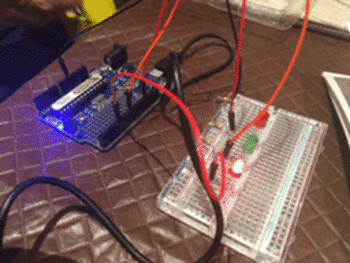

# Arduino Experiments

Exploration into first arduino. Follwing the Freetronics Experiments Kit Project Guide that came with it. 

## Project 1 & 2: [Blinking Lights](Blink)

 

Get some lights blinking in a series back and forth.

## Project 3: [Humidity and Temperature Sensor](Humidity)

Read and log the temperature and humidity in an enviroment at regular intervals. 

``` 
Humidity: 52.50 %	Temperature: 27.90 *C
Humidity: 52.50 %	Temperature: 27.90 *C
Humidity: 52.50 %	Temperature: 27.90 *C
Humidity: 52.50 %	Temperature: 27.90 *C
Humidity: 45.80 %	Temperature: 27.80 *C
Humidity: 45.80 %	Temperature: 27.80 *C
Humidity: 45.80 %	Temperature: 27.80 *C
Humidity: 45.80 %	Temperature: 27.80 *C
Humidity: 45.10 %	Temperature: 27.70 *C
Humidity: 45.10 %	Temperature: 27.70 *C
```


